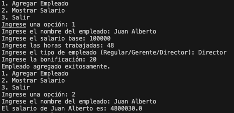
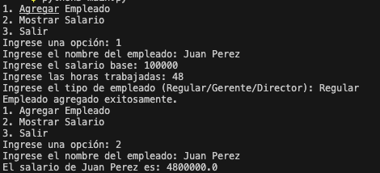
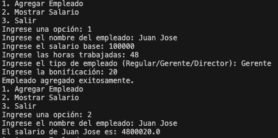

# Sistema de Gestión de Empleados

## Descripción

Este proyecto es un sistema de gestión de empleados diseñado para facilitar la administración de personal en una empresa. Permite agregar empleados, calcular sus salarios y manejar diferentes tipos de empleados como regulares, gerentes y directores con diferentes bonificaciones.

## Características

- Agregar diferentes tipos de empleados (Regular, Gerente, Director).
- Calcular el salario final basado en horas trabajadas y bonificaciones.
- Implementación del patrón MVC (Modelo-Vista-Controlador).
- Uso de principios de Programación Orientada a Objetos como herencia y polimorfismo.

## Cómo Empezar

Para ejecutar este proyecto, sigue estos pasos:

1. Clona el repositorio: `git clone https://TU_TOKEN@github.com/ext-gopages_meli/infradev-challenge-java`.
2. Navega al directorio del proyecto: `cd infradev-challenge-java`.
3. Ejecuta el programa: `python main.py`.

## Estructura del Proyecto

```bash
$ tree .
.
├── README.md
├── docker-compose.yml
├── etc
│   └── Dockerfile
├── evidencias
│   ├── img
│   │   ├── Director.png
│   │   ├── Empleado Regular.png
│   │   └── Gerente.png
│   └── propuesta.md
└── src
    ├── controller
    │   ├── __init__.py
    │   └── controladores.py
    ├── main.py
    └── model
        ├── __init__.py
        ├── director.py
        ├── empleado.py
        ├── empleado_regular.py
        └── gerente.py

```

## Capturas de Ejecución

### Director



### Empleado Regular



### Gerente


